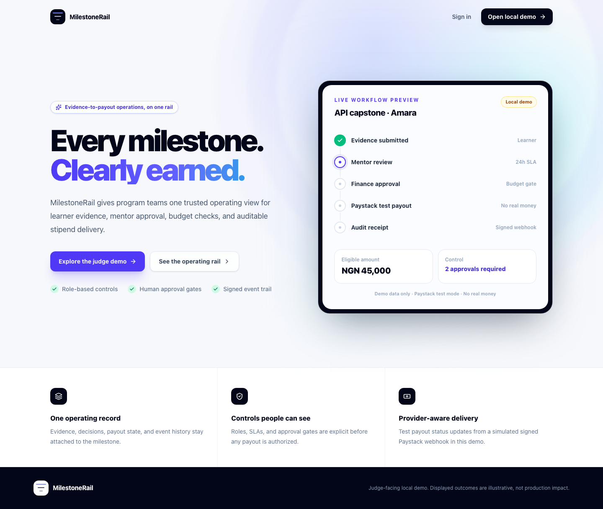

# MilestoneRail

MilestoneRail is an evidence-to-payout operating system for training programs. It keeps learner proof, mentor decisions, finance controls, test payout state, and an append-only audit history on one visible approval rail.

Built for the [Zero to Query LingoQL Hackathon](https://ztq.devpost.com/), the project demonstrates a complete local judge flow and a deployment-ready Sub0 backend definition. The external LingoQL/Sub0 deployment is not yet complete: it awaits the participant's hackathon registration and LingoQL/Sub0 signup. No live URL is claimed in this repository.



## The problem

Training stipends often depend on evidence scattered across links, files, attendance records, messages, spreadsheets, and payment-provider dashboards. Learners cannot see why money is delayed; mentors lose context; finance teams reconcile approvals against payouts manually; program leaders lack one trustworthy chronology.

MilestoneRail makes the handoffs explicit:

1. A learner submits milestone evidence.
2. A mentor approves it or requests changes against a visible rubric.
3. Finance verifies eligibility and budget before authorizing a Paystack test transfer.
4. A signed provider webhook, not the button click, determines terminal payout state.
5. Every human and provider action appears in one searchable audit record.

The target users are stipend-bearing accelerators, bootcamps, workforce programs, NGOs, donor-funded training operators, and their learners, mentors, finance teams, and administrators.

## What is implemented

- Role-specific workspaces for learner, mentor, finance, and admin users
- Evidence submission by HTTPS link or allow-listed file upload
- Rubric-based mentor approval and changes-requested loop
- Separate finance authorization and cohort budget context
- Paystack Transfers integration constrained to test keys and test recipients
- HMAC-SHA512 webhook verification and provider-driven paid/failed state
- Searchable audit history with actor, milestone, timestamp, and provider reference
- Visual workflow studio for approval roles, order, activation, and SLA settings
- Targeted WebSocket events that invalidate and refresh client data
- Scheduled SLA scanning with deduplicated audit events
- Deterministic, protected, idempotent demo seeding
- Responsive desktop and mobile judge flows

The in-browser demo simulates provider completion after a short delay so the full story can be judged without external credentials. The version-controlled Sub0 resources contain the real queued Paystack test request and signed webhook path intended for deployment.

## Architecture

The Vite single-page application calls Sub0 resources over HTTPS and subscribes to the Sub0 WebSocket endpoint. Sub0 validates requests, re-checks identity and role in PostgreSQL, performs guarded state transitions, appends audit events, queues the Paystack test transfer, and accepts signed provider callbacks. LingoQL is the intended static frontend host and Sub0 runtime.

See [docs/architecture.md](docs/architecture.md) for the system/data-flow diagram, data model, trust boundaries, realtime behavior, failure controls, and dashboard verification points.

## Exact stack

Frontend dependencies as declared in `package.json`:

- React `^19.2.7` and React DOM `^19.2.7`
- TypeScript `~6.0.2` and Vite `^8.1.1`
- Tailwind CSS `^4.3.3`
- React Router `^7.18.1`
- TanStack React Query `^5.101.4`
- React Hook Form `^7.82.0`, Zod `^4.4.3`, and Hookform Resolvers `^5.4.0`
- XYFlow React `^12.11.2` for the workflow studio
- Recharts `^3.10.0` for operational activity
- Lucide React `^1.25.0`, date-fns `^4.4.0`, clsx `^2.1.1`, and tailwind-merge `^3.6.0`

Backend and infrastructure:

- LingoQL static-site deployment
- Sub0 declarative models and API/ABI resources
- PostgreSQL
- Paystack Transfers API in test mode
- Sub0 file storage, queues, cron jobs, webhooks, and WebSockets

Quality tooling:

- Vitest `^4.1.10`, Testing Library React `^16.3.2`, user-event `^14.6.1`, jsdom `^29.1.1`, and MSW `^2.15.0`
- Playwright `^1.61.1` with desktop Chromium and iPhone 13 projects
- Oxlint `^1.71.0` and Prettier `^3.9.6`

## Why Sub0 and LingoQL are central

This is not a frontend-only mock wrapped around generic CRUD. The production path is expressed as eight relational models and eleven Sub0 resources under `sub0/`.

- Models encode organizations, users, cohorts, milestones, workflow steps, submissions, payouts, and audit events.
- JWT issuance and verification use HS256, bcrypt password verification, five scoped claims, an eight-hour expiry, and per-IP sign-in limiting.
- Protected SQL resources re-check the active user, organization, and role rather than trusting a token claim as authorization.
- Optimistic status-qualified updates prevent stale evidence, review, and payout requests from overwriting newer state.
- Action chaining authorizes an upload before storage and gates the queued Paystack request on a protected SQL result.
- Upload rules allow one file, cap it at 10 MiB, use a MIME allow-list, and scope storage paths by organization and user.
- The payout resource accepts only `sk_test_` configuration, creates one guarded payout reference, converts NGN to kobo, and queues a background transfer with three retries.
- The webhook resource verifies Paystack's raw-body HMAC-SHA512 signature, allow-lists transfer events, updates only non-terminal payouts, appends an audit event, and targets the learner with a WebSocket notification.
- `submission.updated`, `payout.updated`, and `workflow.updated` broadcasts trigger React Query invalidation; the client reconnects with bounded exponential backoff.
- A six-field cron expression scans SLA breaches every 15 minutes and deduplicates them with a deterministic event key.
- Environment accessors keep database, JWT, seed, and Paystack secrets out of the ABI files.

The intended LingoQL deployment hosts the static Vite build with `npm run build` and output directory `dist`. The deployment procedure is in [docs/deployment.md](docs/deployment.md); the exact Sub0 import order remains canonical in [sub0/README.md](sub0/README.md).

## Run the local judge demo

Requirements: Node.js 20.19+ or 22.12+ and npm.

```sh
npm ci
cp .env.example .env.local
npm run dev
```

Keep `VITE_DEMO_MODE=true` for this local flow, then open the URL printed by Vite. Select a role on the sign-in screen, or use any account below with password `demo2026`:

- Learner: `amara@demo.milestonerail.app`
- Mentor: `david@demo.milestonerail.app`
- Finance: `fatima@demo.milestonerail.app`
- Admin: `nia@demo.milestonerail.app`

Recommended path: submit Amara's API capstone as Learner, switch to Mentor and approve it, switch to Finance and authorize the test payout, wait for the simulated signed webhook, then open Audit. Role switching preserves the in-memory state for the current tab. Reloading the application resets the local demo baseline.

## Production setup

Do not enable local demo mode on the judged deployment.

1. Register for the hackathon and complete the participant's LingoQL/Sub0 signup.
2. Create a Sub0 project with PostgreSQL.
3. Import the models and resources in the order documented in [sub0/README.md](sub0/README.md).
4. Set Sub0 custom and system variables from `sub0/env.example`, using only a Paystack `sk_test_` secret and test recipient.
5. Seed the deterministic demo once from an administrative environment.
6. Deploy the frontend to LingoQL with `VITE_DEMO_MODE=false`, the deployed HTTPS Sub0 URL, and its WSS endpoint.
7. Restrict `ALLOWED_ORIGINS` to the final frontend origin, run the read-only Sub0 smoke script, and complete the dashboard-only checks.

Full instructions, rollback guidance, and the credential-handling warning are in [docs/deployment.md](docs/deployment.md).

## Verification

Run these before submission:

```sh
npm run verify
npm run test:e2e
```

Optional deployed-backend check:

```sh
SUB0_BASE_URL=https://YOUR_SUB0_HOST \
SUB0_SMOKE_EMAIL=amara@demo.milestonerail.app \
SUB0_SMOKE_PASSWORD=demo2026 \
npm run smoke:sub0
```

Result placeholders for the participant's final submission pass:

- `npm run verify`: `[record date, commit, and pass/fail after final run]`
- `npm run test:e2e`: `[record desktop/mobile result after final run]`
- `npm run smoke:sub0`: `[pending external Sub0 deployment and dashboard verification]`
- LingoQL production smoke: `[pending participant signup, deploy, and final origin]`

The smoke script is read-only apart from sign-in rate-limit accounting and never invokes `payouts/initiate`.

## Security and test-money notice

MilestoneRail is hackathon software, not a production payment system or financial service. Every included payout flow must remain in Paystack test mode; no real money should move. Never place database credentials, JWT secrets, seed secrets, Paystack keys, or recipient details in source control, documentation, screenshots, videos, issues, or chat.

The local demo's accounts, metrics, balances, completion rate, activity chart, and paid records are deterministic fixtures. They are not measured customer outcomes. A production launch would still require threat modeling, independent security review, privacy and retention policies, backups and restore testing, observability, reconciliation operations, legal/compliance review, recipient onboarding controls, and live-money safeguards that are deliberately outside this demo.

## Business model

MilestoneRail is designed as a business-to-business SaaS for program operators:

- A base subscription per active program or cohort
- Usage tiers by active learner and workflow volume
- Higher tiers for multi-organization controls, configurable approval policies, exports, SSO, and support
- Optional implementation and reconciliation services for larger operators

This is a proposed model, not evidence of revenue, customers, or market validation.

## Repository map

- `src/` — React application, role-aware pages, API client, realtime hooks, and local demo store
- `sub0/models/` — eight PostgreSQL model definitions
- `sub0/resources/` — eleven Sub0 API/ABI resources
- `sub0/README.md` — canonical import order, environment assumptions, and dashboard checks
- `scripts/validate-sub0.mjs` — strict JSON and security-invariant validation
- `scripts/smoke-sub0.mjs` — opt-in deployed Sub0 read-only smoke checks
- `e2e/` — desktop and mobile judge-flow tests
- `docs/architecture.md` — architecture, data model, trust boundaries, and failure controls
- `docs/deployment.md` — LingoQL/Sub0/Paystack test deployment runbook
- `docs/demo-script.md` — timed 3–5 minute presentation
- `docs/devpost-submission.md` — ready-to-paste submission copy and evidence checklist
- `docs/research.md` — official and public research sources with claim boundaries

## Project and source links

- Public repository: `[add the participant's accessible GitHub or GitLab URL]`
- Live demo: `[pending participant LingoQL/Sub0 signup and successful deployment]`
- Demo video: `[add the public 3–5 minute video URL]`
- Hackathon: [Zero to Query on Devpost](https://ztq.devpost.com/)
- Official rules: [Zero to Query rules](https://ztq.devpost.com/rules)
- LingoQL/Sub0 docs: [documentation index](https://docs.lingoql.com/llms.txt)
- Paystack test transfer docs: [Single Transfers](https://paystack.com/docs/transfers/single-transfers/) and [Webhooks](https://paystack.com/docs/payments/webhooks/)
- Research notes: [docs/research.md](docs/research.md)

## License and contribution

Released under the [MIT License](LICENSE). See [CONTRIBUTING.md](CONTRIBUTING.md) for scoped contribution and verification guidance.
