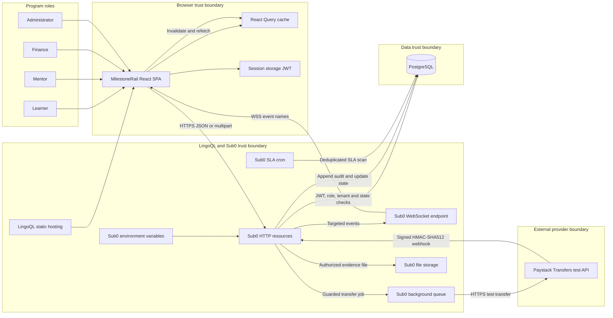
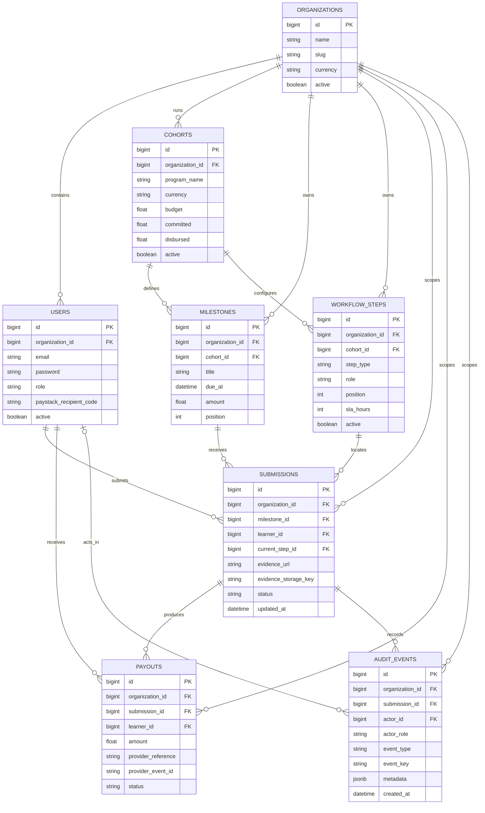

# MilestoneRail architecture

## System and data flow



The local judge mode follows the same user-visible state machine but replaces Sub0, PostgreSQL, storage, WebSockets, and Paystack with an in-memory browser store. It is a demonstrator and automated-test fixture, not evidence that the external deployment has run.

## Runtime responsibilities

The browser renders role-aware routes, validates forms for immediate feedback, stores the current session in `sessionStorage`, calls named Sub0 resources, and refreshes cached views after mutations or realtime events. It never receives backend secrets.

Sub0 is the policy and orchestration layer. Its checked-in JSON defines authentication, validation, SQL, file handling, asynchronous HTTP work, webhook verification, broadcasts, scheduled work, and environment access. PostgreSQL is the system of record. Paystack is an external test-only state source: finance authorization creates a processing record, but only an accepted provider webhook can mark that record paid or failed.

LingoQL is the intended host for the Vite static build and the platform surrounding the Sub0 runtime. This external deployment awaits the participant's LingoQL/Sub0 signup.

## Data model



Every tenant-owned record carries `organization_id`. The API joins that key through the authenticated, active caller. Learner-visible records add a learner ownership condition. The newest active cohort is the dashboard's operating cohort.

The main submission state machine is:

```text
draft ─┬─> submitted ─┬─> awaiting_finance ─> processing ─┬─> paid
       │              │                                   └─> failed
       │              └─> changes_requested ────────────────> submitted
       └─────────────────────────────────────────────────────> submitted
```

## Sub0 resource inventory

Each resource is version controlled under `sub0/resources/`; the route names must remain stable because the frontend calls them directly.

- `auth/sign-in` verifies bcrypt passwords, rejects inactive or ambiguous accounts, limits attempts to five per IP per five minutes, and issues an eight-hour HS256 JWT. It is load-bearing because all role and tenant context begins here.
- `dashboard` returns the current cohort, calculated summary, seven-day activity, visible submissions, payouts, and events in the exact camelCase client shape. It is load-bearing because every operational view derives from this scoped read model.
- `workflows/list` returns the active cohort's ordered rail for all authenticated roles. It keeps the visual rail and operational status views consistent.
- `workflows/save` validates and upserts at most 20 ordered stages for an administrator, deactivates omitted stages, and emits `workflow.updated`. It makes the approval policy editable without adding a custom server.
- `submissions/evidence-link` accepts a learner-owned HTTPS link only from `draft` or `changes_requested`, advances to mentor review, appends an audit event, and emits `submission.updated`.
- `submissions/evidence-upload` authorizes the learner and submission before storage, accepts one allow-listed file up to 10 MiB, stores it in an organization/user-scoped folder, advances state, and audits the handoff. The pre-upload action chain prevents storage from becoming an authorization bypass.
- `submissions/review` restricts decisions to mentor/admin callers, accepts only a currently submitted record, routes approval to finance or changes back to evidence, and appends the decision. It is the human quality gate and preserves separation from payout authorization.
- `payouts/initiate` restricts callers to finance/admin, requires `awaiting_finance`, a test recipient, and an `sk_test_` secret, then atomically moves the submission, creates a payout/audit pair, and queues a Paystack test transfer. It is the financial control boundary.
- `webhooks/paystack` verifies the raw body with HMAC-SHA512, accepts only transfer success/failure/reversal events, updates only a non-terminal test payout, appends the provider event, and notifies the learner. It is load-bearing because provider evidence, not UI optimism, determines final state.
- `jobs/sla-scan` runs every 15 minutes, finds submissions beyond the active step's SLA, and appends one event per submission/status/update timestamp. It turns configured SLAs into operational attention.
- `admin/demo-seed` requires a separate environment-backed header secret, rate-limits calls, hashes the supplied password with bcrypt cost 12, and restores deterministic fixture rows. It makes judging repeatable without exposing a public reset endpoint.

## Why the Sub0 features are load-bearing

- Declarative models provide one checked-in schema contract for PostgreSQL instead of an undocumented dashboard-only schema.
- SQL actionables keep tenant joins, role checks, and status transitions in the same transaction as writes and audit inserts.
- JWT tokenization and protected claim extraction establish identity, while SQL re-validation prevents stale or forged claims from becoming authorization.
- Payload validation and per-resource rate limits reject malformed input and reduce brute-force or accidental request floods before work runs.
- Environment accessors keep the database URL, JWT secret, seed secret, Paystack test key, and recipient code outside source-controlled ABI files.
- Action chaining makes authorization output a prerequisite for upload and external transfer actions.
- File-upload policies constrain count, size, MIME type, and path before evidence metadata is attached to a submission.
- Background queueing keeps the finance response independent of provider latency; three retries provide bounded transient-failure handling.
- HMAC webhook verification authenticates the public provider callback over the raw body.
- Targeted WebSocket broadcasts refresh affected clients without broadcasting tenant data to every connection.
- Cron execution converts workflow SLA configuration into recurring, auditable controls.
- Hashing and header verification protect demo initialization even though the seed itself is deterministic.

Removing any of these features would either break the primary user journey or move a critical trust decision into the browser.

## Trust boundaries and controls

### Public browser

All browser payloads, URL parameters, multipart metadata, and JWT claims are untrusted. Client-side Zod validation is usability support, not authorization. Protected Sub0 queries re-select the active user with matching `id`, `organizationId`, and `role`; learner writes also match `learner_id`.

The JWT is currently held in `sessionStorage`. This limits persistence to the tab but remains exposed to successful same-origin script injection. Production hardening should add a strict content security policy, dependency review, XSS testing, and a documented token strategy.

All `VITE_*` values are compiled into public assets. They may contain only public service URLs and the non-secret demo-mode flag.

### LingoQL/Sub0 runtime

Sub0 custom variables contain secrets and are configured only in the dashboard. ABI resources reference them through `$ENV`. System variables restrict origins, methods, payload size, and WebSocket behavior. Operators must not copy secret values into source, screenshots, videos, issues, or chat.

### PostgreSQL and file storage

Organization scoping is applied in SQL instead of relying on the frontend. Audit events have no update or delete resource. Uploaded files are authorized before storage and partitioned by organization and user, but production still needs retention, malware scanning, access-expiry, backup, and restore policies.

### Paystack

Only Paystack test mode is supported. Both the dispatch query and background request require an `sk_test_` key and reject `sk_live_`; recipients must begin `RCP_`. The public callback accepts state changes only after signature verification. No real-money launch is implied or supported by these hackathon resources.

### Administrative seed

The seed is a webhook-like administrative endpoint protected by a dedicated header secret and rate limit. Run it from a controlled shell, then disable or remove it and rotate its secret before any real-user environment.

## Realtime behavior

The production client connects to `VITE_SUB0_WS_URL` with `uid=<authenticated user id>` and WebSocket subprotocols `["x-access-token", "<JWT>"]`. It recognizes only:

- `submission.updated`
- `payout.updated`
- `workflow.updated`

Any recognized event invalidates the current user's dashboard query; workflow events also invalidate the workflow query. A clean close stops reconnection. An unexpected close retries with bounded exponential backoff, beginning at approximately two seconds and capping at 15 seconds. Malformed messages and provider keepalives are ignored.

Protected writes target the authenticated caller, while the Paystack webhook targets the learner attached to the payout. This avoids all-client and cross-tenant broadcasts. It also means cross-role fan-out is not yet implemented: a mentor already sitting on the review page is not directly targeted by a learner's submission event, and a finance user is not directly targeted by a mentor decision. Navigation, mutation success, or manual refetch still loads current database state. A production multi-user release should add an organization-scoped recipient registry or explicit role-recipient broadcasts without weakening tenant isolation.

## Failure, concurrency, and idempotency controls

- Evidence updates require `draft` or `changes_requested`; review requires `submitted`; payout requires `awaiting_finance`. Each `UPDATE` repeats the expected status so stale concurrent requests return zero rows.
- Payout creation checks that no queued, processing, or paid payout exists, then conditionally locks the submission by moving it to `processing`. A losing concurrent request has no row from which to create a payout.
- Provider references are generated once from a UUID. The transfer amount is converted from the stored cohort currency amount to kobo immediately before dispatch.
- The Paystack HTTP action is queued and retried three times. Exhausted retries can leave a payout in `processing`; operators must inspect queue logs and reconcile it in test mode.
- Webhooks update only `queued` or `processing` payout rows and allow-list three transfer event names. A duplicate or late callback cannot rewrite a terminal record or append another event through this resource.
- The webhook SQL updates payout, submission, and audit history as one chained database operation before broadcasting.
- SLA events use a key derived from submission, status, and `updated_at`, with `NOT EXISTS` deduplication. The current model marks `event_key` indexable but does not declare a uniqueness constraint; concurrent duplicate cron executions should be checked in the deployed runtime, and production should add a database uniqueness guarantee if supported.
- Seed rows are upserted by deterministic primary keys; seeded audit rows use `ON CONFLICT DO NOTHING`. Re-running the seed restores the demo baseline and is therefore idempotent but destructive to demo progress.
- The local browser store resets on reload and simulates a successful signed webhook after 1.4 seconds. This is intentionally different from provider reliability and must be described as simulation.

## Deployment assumptions

- A participant-owned LingoQL/Sub0 account and hackathon credit are required; signup is still outstanding.
- The Sub0 project uses PostgreSQL and creates the unprefixed table names in `sub0/models/`.
- Models are imported before resources in the exact order in `sub0/README.md`.
- PostgreSQL preserves quoted camelCase aliases; timestamps are cast to text for the client contract.
- The Vite frontend is deployed as a static SPA with build command `npm run build` and output directory `dist`.
- Production build variables set `VITE_DEMO_MODE=false`, an HTTPS `VITE_SUB0_HTTP_URL`, and a WSS `VITE_SUB0_WS_URL`.
- Sub0 enables WebSockets, requires a UID, uses route `ws`, accepts `POST|OPTIONS`, sets a 12 MiB payload ceiling for multipart overhead, and allows only the final frontend origin.
- Paystack configuration contains a test secret, test recipient, and public callback `https://YOUR_SUB0_HOST/webhooks/paystack`.
- The seed is run once before recording. Running it again intentionally resets the demo.
- Sub0 does not provide a local runtime or public offline ABI compiler, so deployment behavior cannot be proven by static validation alone.

## Sub0 dashboard verification points

Complete these in the deployed dashboard before exposing the frontend:

1. Preview `dashboard` and verify `data` is one object, not a one-element array. If needed, select the single-record/first-result response mode.
2. Preview `workflows/save` and confirm `$PAYLOAD.steps` binds as JSON to PostgreSQL `jsonb_array_elements`, with an array response.
3. Preview `submissions/evidence-upload` and confirm the sole upload metadata object reaches query action 3. If the runtime retains a one-element array, map `url`, `storage_key`, and `original_file_name` from index `0`.
4. Preview `payouts/initiate` and verify query action 1 remains `main_returnable` while HTTP action 2 runs queued; the immediate response must be the payout object, not queue metadata.
5. Configure zero-row optimistic guards as HTTP `409 Conflict` if the project's response policy supports it. Do not loosen SQL guards.
6. Preview a protected WebSocket connection with subprotocols `["x-access-token", "<JWT>"]`.

After those checks, run `npm run smoke:sub0`. That script verifies anonymous rejection, sign-in shape, dashboard shape, and workflow shape; it never initiates a payout.
